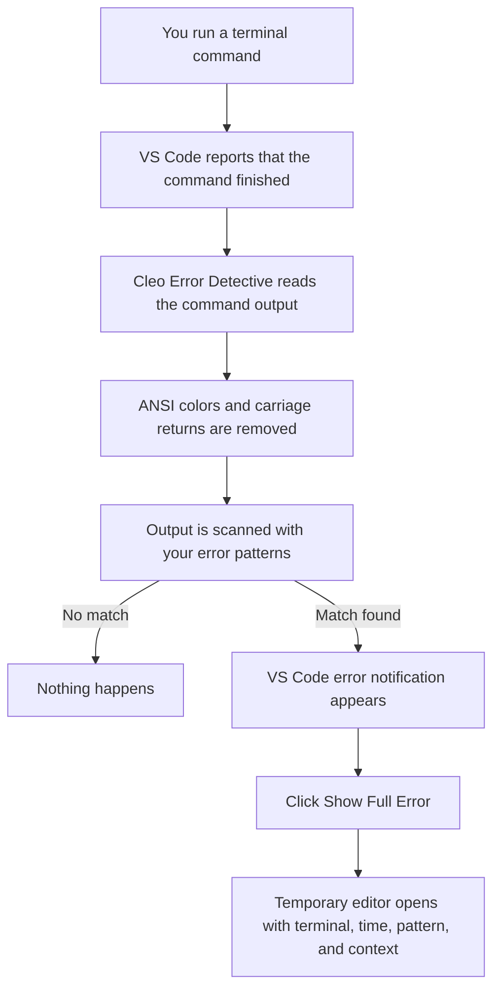
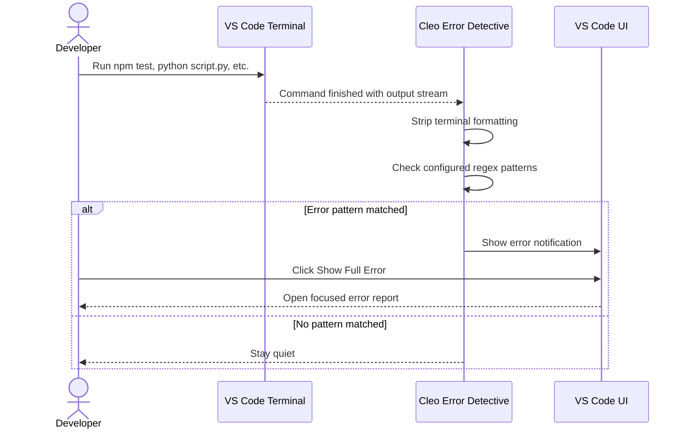
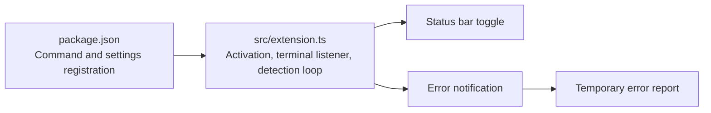

# Cleo Error Detective

A small VS Code extension that watches terminal commands and surfaces likely errors as soon as each command finishes.

Instead of scrolling back through noisy terminal output, you get a focused notification and a short error report with the matching line and nearby context.

## At A Glance



## What It Does

Cleo Error Detective listens to every integrated VS Code terminal. After a command completes, it scans that command's output against a configurable list of case-insensitive regex patterns.

When a pattern matches, the extension shows a VS Code error notification with a short preview. Choosing **Show Full Error** opens a plain text report containing:

- The terminal name
- The detection timestamp
- The pattern that matched
- A focused block of output around the error

The extension also adds a status bar toggle in the bottom-right corner:

```text
$(bug) Cleo Errors: ON
```

Click it to turn detection on or off. You can also use **Ctrl+Shift+P > Cleo: Toggle Terminal Error Detection**.

## User Flow



## Default Error Patterns

The built-in patterns catch common failure shapes:

| Pattern | Typical Source |
| --- | --- |
| `Error:` | General JavaScript and TypeScript errors |
| `TypeError:`, `SyntaxError:`, `ReferenceError:` | Specific JavaScript runtime errors |
| `UnhandledPromiseRejection` | Unhandled async failures |
| `ENOENT`, `ECONNREFUSED` | File and network system errors |
| `exit code [1-9]` | Non-zero command exits |
| `npm ERR!`, `yarn error` | Package manager failures |
| `FATAL` | Critical process failures |
| `Traceback (most recent call last)` | Python exceptions |

You can edit these in **Settings > Cleo Error Detective > Patterns** without changing code.

Because the patterns are regular expressions, you can add project-specific checks such as `Build failed`, `MigrationError`, or `Connection refused`.

## Settings

```json
{
  "cleoErrorDetective.enabled": true,
  "cleoErrorDetective.patterns": [
    "Error:",
    "TypeError:",
    "SyntaxError:",
    "ReferenceError:",
    "UnhandledPromiseRejection",
    "ENOENT",
    "ECONNREFUSED",
    "exit code [1-9]",
    "npm ERR!",
    "yarn error",
    "FATAL",
    "Traceback (most recent call last)"
  ]
}
```

## How The Extension Is Wired



## Development Setup

Requirements:

- Node.js
- VS Code 1.93 or newer

Install dependencies and compile the extension:

```bash
npm install
npm run compile
```

Press **F5** to open the Extension Development Host. This launches a second VS Code window with Cleo Error Detective running.

For automatic recompilation while editing:

```bash
npm run watch
```

After recompiling, reload the Extension Development Host with **Ctrl+Shift+P > Developer: Reload Window**.
